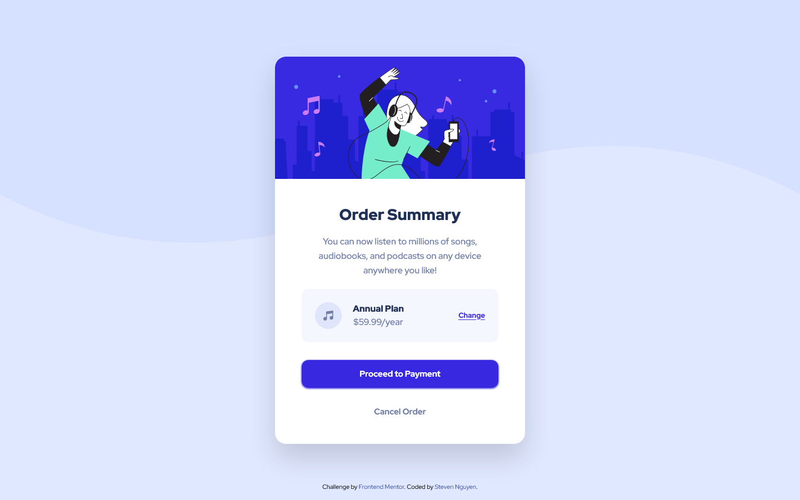

# Frontend Mentor - Order summary card solution

This is a solution to the [Order summary card challenge on Frontend Mentor](https://www.frontendmentor.io/challenges/order-summary-component-QlPmajDUj). Frontend Mentor challenges help you improve your coding skills by building realistic projects.

## Table of contents

- [Overview](#overview)
  - [The challenge](#the-challenge)
  - [Screenshot](#screenshot)
  - [Links](#links)
- [My process](#my-process)
  - [Built with](#built-with)
  - [What I learned](#what-i-learned)
  - [Continued development](#continued-development)
- [Author](#author)

## Overview

### The challenge

Users should be able to:

- See hover states for interactive elements

### Screenshot

### Desktop Screenshot

### Mobile Screenshot

### Links

- Solution URL: https://github.com/snguyen56/order-summary-component-tailwind
- Live Site URL: https://snguyen56.github.io/order-summary-component-tailwind/

## My process

### Built with

- Semantic HTML5 markup
- Mobile-first workflow
- Utility-first workflow
- [React](https://reactjs.org/) - JS library
- [Vite](https://vitejs.dev/) - Build Tool
- [Tailwind CSS](https://tailwindcss.com/) - For styles
- [Github Pages](https://pages.github.com/) - Hosting

### What I learned

Nothing new was encountered in this challenge. The only issue I had was the svg for the hero image did not render at first, but that was because I tried to convert it to the React format for its attributes. Other than that, the challenge was more of a refresher of the basics of frontend.

### Continued development

As I aim for visual accuracy with these challenges, I often have to use arbitrary values with Tailwind. This tends to lead to accidental repetition of styling code if I'm not careful. I need to keep a closer eye on this issue moving forward and try to not repeat myself in code.

## Author

- Website - https://snguyen56.github.io/
- Github - https://github.com/snguyen56
- LinkedIn - [Steven Nguyen](https://www.linkedin.com/in/steven-nguyen-bb5568216/)
- Frontend Mentor - [@snguyen56](https://www.frontendmentor.io/profile/snguyen56)
